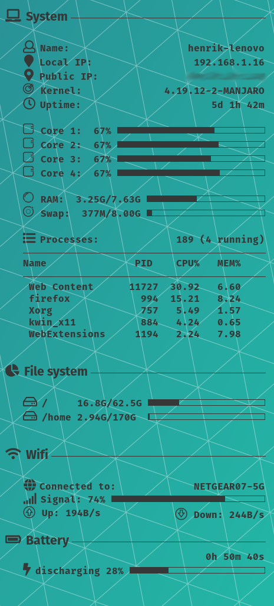

# conky-config
Simple configuration file for Conky on Linux laptop connected to Wifi.

Required fonts:
<ul>
  <li>Fira Sans</li>
  <li>Fira Code</li>
  <li>Font Awesome 5</li>
  <li>StyleBats</li>
</ul>

